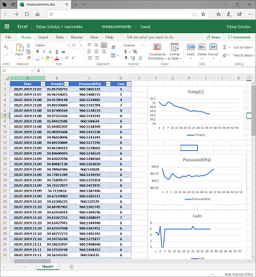

# Værmelder - Enviro HAT to Excel Online logger
> Uses the Pimoroni [EnviroHAT](https://shop.pimoroni.com/products/enviro-phat) to log specific values via Microsoft Graph API to an Online Excel Sheet document.

## Prerequirements
- Raspberry Pi Z (works also with 2 and 3)
- Pimoroni [EnviroHAT](https://shop.pimoroni.com/products/enviro-phat)
- Raspbian Linux
- Python 3.5 (installed on Rasbian)
- Office 365 Business or School account (May change)

## Before run
1. Attach the HAT to the Raspberry Pi
2. (Optional) check with the HAT's examples if everything works
3. Register new App in Azure Active Directory App Registration ([MS Docs](https://docs.microsoft.com/en-us/azure/active-directory/develop/quickstart-register-app))
4. Grant `Files.ReadWrite` permissions to the registered app
5. Upload attached `measurements.xslx` template to `/Apps/<your_app_name>/measurements` of your OneDrive
6. Update the `config.py` with your `CLIENT_ID` and `APP_NAME`.

## Run
1. Use a vnc or ssh connection to log into your Pi
2. `cd <source folder>`
3. `pip3 install -r requirements.txt`
4. `python3 main.py`
5. You will be prompted to open a link and enter a code. This must not happen on the slow Pi, you can use your default computer

### Hint
You need to use `pip3` and `python3` if the system's Python is bind to a `2.x`. Check this via the `python --version` terminal command. It is recommended to run the script in a detachable shell session with `screen` or something similar.

The sync timer will tick every 10 minutes.

## How it looks

Excel online with custom created diagrams.

Script run in a terminal.

# Stop
Hit `Ctrl+C` in the terminal that runs the staeted Python process.

## Contributing

Feel free to improve the quality of the code. It would be great to learn more from experienced Python, Microsoft Graph and IoT developers.

## Authors

Just me, [Tobi]([https://tscholze.github.io).

## License

This project is licensed under the MIT License - see the [LICENSE](LICENSE.md) file for details.
Dependencies or assets maybe licensed differently.
